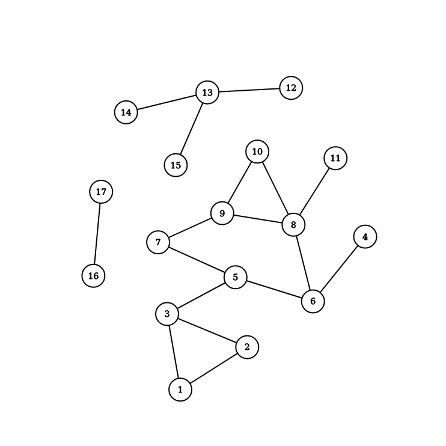

# Тестовое задание для Avito

## System requirements

* Ubuntu 20.04 LTS
* PostgreSQL 12.2

## Задание 1

```sql
select c.city
  from (
    select
      city,
      row_number() OVER (
        ORDER BY city DESC
      ) AS num
    from test_case
    ) as c
order by
case
  when c.city = 'Москва' then 0
  when c.city = 'Санкт-Петербург' then (select count(city) from test_case) + 1
  else num
end;
```
### Порядок выполнения запросов

1. Сортируем все данные, добавляем ещё один признак для сортировки с учотом
требований задания.

```sql
select
  city,
  row_number() OVER (
    ORDER BY city DESC
  ) AS num
from test_case
```

  Результатом выполнения подзапроса будет набор данных с двумя колонками `city`
и `num`. В колнке `city` названия всех городов. В колонке "num" номер строки.
Данные будут отсортированы в обратном алфавитном порядке.

|city|num|
|-|-|
|Челябинск|1|
|Санкт-Петербург|2|
|Москва|3|
|Воронеж|4|
|Абакан|5|

2. Применяем сотрировку учитывая задание при помощи дополнительного признака.

```sql
select c.city
  from (
    --- Response from item 1
    ) as c
order by
case
  when c.city = 'Москва' then 0
  when c.city = 'Санкт-Петербург' then (select count(city) from test_case) + 1
  else num
end;
```

В данном случае для произвольной сортировки мы используем директиву `case`.
* Городу "Москва" назначаем признак сортировки 0 - так как он должен быть
перым в наборе данных.
* Городу "Санкт-Петербург" назначем признак из подзапроса:

```sql
(select count(city) from test_case) + 1
```

Это количество строк в таблице + 1. Чтобы "Санкт-Петербург" гарантировано
оказался последним в наборе.

* Остальным строкам назначем признак из колнки `num` так как он уже
остортирован в обратном алфавитном порядке.

В итоге получаем список где на первом месте "Москва", на последнем
"Санкт-Петербург" остальные строки отсортированы в обратном алфавитном порядке.

## Задание 2

### Результат
Результатом будет сумма всех чисел от 1 до
```sql
(select count(event_date) limit 100)
```

```
1 + 2 + 3 + 4 + 5 ... n
```

Если в таблице 100 или больше записей то результат будет: 4950

### Почему

Разберём весь запрос на подзапросы:

1. Выполняется подзапрос
```sql
    SELECT event_date
    FROM DMA.calendar
    LIMIT 100
```

  Результатом будет набор данных с колонкой `event_date` из таблицы `calendar`
базы данных `DMA`. Первые 100 записей. Так как не указано условие `ORDER BY`
записи будут перечислены в порядке записи в таблицу по принципу "Первым пришёл
 \- первым ушёл"

2. Выполняется подзапрос
```sql
    SELECT SUM(1) OVER(ORDER BY event_date) AS s
    FROM (
    --- Response from item 1
    ) t
```
  Результатом будет набор данных с колонкой `s` (`AS s`). С нумерацией от 1 до
  100 (максимум). Этот запрос - альтернатива `row_number() over() as s`.

  |s|
  |-|
  |1|
  |2|
  |3|
  |4|
  |5|
  |...|
  |100|

3. Выполняется запрос

```sql
SELECT SUM(s)
FROM (
  --- Response from item 2
) t
```

Результатом будет сумма всех чсел от 1 до 99 (Если в таблице `DMA.calendar`
больше или равно 100 записей)

```
1 + 2 + 3 + 4 + 5 + ... + 99 = 4950
```

## Задание 3

Код программы в файле `clusters/clusters.py`

### Как это рабаотает

Метод `get_graph_from_db` возвращает словарь значений в котором рёбра 
неориентированного графа из таблицы `edges` развёрнуты в виде узлов.
По `id` каждого узла можно получить список всех его соседей.

Метод `get_list_of_all_edges` возвращает список всех узлов графа.

Метод `breadth_first_search` это реализация алгоритма поиска в ширину (breadth-first search). Метод
получает в виде аргументов граф и два id узлов. Если между узлами есть путь то метод возвращает `True`
в ином случае `False`.

Метод `write_edges_to_number_to_db` записывает готовый словарь из номеров компонент связанности и списка вершин в базу 
данных одним запросом.

Основной метод обходит все вершины до которых сущствует маршрут. Если маршрута нет то такие точки не относятся к данной 
компоненте связанности. После каждого прохода алгоритма мы выделяем одну новую компоненту связанности и помечаем все её 
вершины как проверенные в списке `checked_edges`. После того как все вершины пройдены мы можем записать результат в 
таблицу `clusters` базы данных. 

### Пример

В файле `clusters/init.sql` содержиться дамп таблицы в которую развёрнут неориентированный граф.

Визуализация этого графа:



Алгоритм запишет в базу три компоненты связанности.

| Number        | List of edges           | 
| ------------- |:----------------------:|
| 0 | 1, 2, 3, 4, 5, 6, 7, 8, 9, 10, 11  |
| 1 | 12, 13, 14, 15                     |
| 2 | 16, 17                             |
